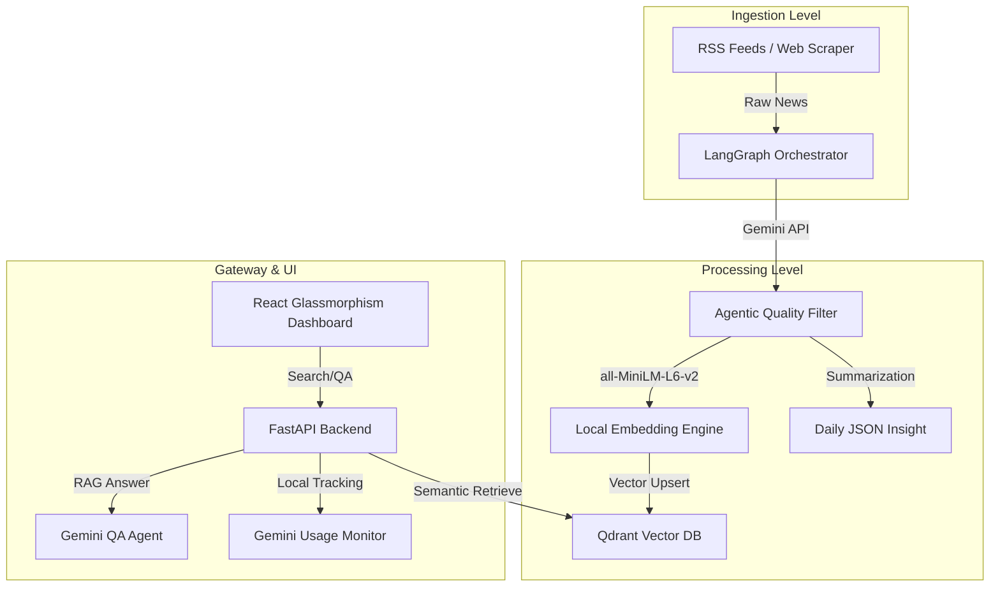

<div align="center">

  # Sekilas.ai — Intelligent News Agentic-RAG
  **Autonomous News Aggregation, Semantic Search, and RAG-Driven AI Question-Answering.**
  
  [](https://fastapi.tiangolo.com/)
  [](https://reactjs.org/)
  [](https://www.typescriptlang.org/)
  [](https://qdrant.tech/)
  [](https://aistudio.google.com/)
  [](https://www.python.org/)
</div>

---

## Overview

In the era of information overload, finding relevant news is a challenge. **Sekilas.ai** is a **functional Agentic-RAG system** in active development that automates the news lifecycle: from scraping RSS feeds to generating AI-powered daily insights.

This project serves as a **Managed AI Intelligence Service** that demonstrates how to understand context, filter noise, and answer complex queries using current news data.

## Technical Features

- **Autonomous Data Pipeline**: End-to-end news ingestion orchestrated by LangGraph, featuring automated scraping, quality filtering, and deduplication.
- **Agentic Summarization**: Intelligent LLM-based categorization and multi-point summarization to provide structured, actionable insights.
- **Semantic Vector Store**: High-performance semantic retrieval using Qdrant Vector DB and locally-hosted all-MiniLM-L6-v2 embedding models.
- **RAG-Powered Question Answering**: Advanced RAG (Retrieval-Augmented Generation) system providing accurate answers backed by source citations from recent news.
- **API Quota Management**: Integrated monitoring system to track Gemini API usage locally with manual synchronization support.
- **Professional Dashboard**: State-of-the-art responsive interface built with React and Tailwind CSS, featuring glassmorphism aesthetics and motion-driven interactions.

## Technology Stack

### Backend
- Framework: FastAPI
- Orchestration: LangGraph
- Models: Google Gemini 3.1 Flash Lite Preview, all-MiniLM-L6-v2 (Local)
- Validation: Pydantic v2
- Scraping: BeautifulSoup4, Feedparser

### Frontend
- Framework: React 19 (TypeScript)
- Styling: TailwindCSS, Vanilla CSS
- Animations: Motion (formerly Framer Motion)
- Icons: Lucide React

### Infrastructure
- Vector Database: Qdrant
- Configuration: Pydantic Settings
- Environment: Python 3.11+, Node.js 18+

## System Architecture



---

## Performance & Limits

Sekilas.ai optimizes resource usage while maintaining high accuracy for both Indonesian and International news sources.

### Core Metrics & Operational Limits
| Parameter | Value | Description |
| :--- | :--- | :--- |
| **Daily API Quota** | **500 RPD** | Managed via Gemini usage tracker |
| **Ingestion Capacity** | **Max 50/run** | Configurable limit per orchestrator execution |
| **Embedding Context** | **384 Dim** | Optimized via all-MiniLM-L6-v2 local model |
| **QA Latency** | **~2-4s** | Streaming-optimized RAG response time |

---

## Deployment Guide

### Prerequisites
*   Python 3.11+
*   Node.js 18+
*   Qdrant Cloud / Local Instance

### Execution Options
Deploy the application and its ecosystem using the following standard procedures:

**Option 1: Full-Stack Development Mode**
```bash
# Terminal 1: Backend
python -m uvicorn backend.api.app:app --reload

# Terminal 2: Frontend
cd frontend
npm run dev
```

**Option 2: Pipeline Execution**
```bash
# Initialize Collection (First time only)
python -m backend.scripts.init_vector_db

# Execute Autonomous Pipeline
python -m backend.pipeline.orchestrator
```

## Configuration

The application is configured via environment variables. Key variables include:
- `GEMINI_API_KEY`: API key for Google Generative AI.
- `QDRANT_URL` / `QDRANT_API_KEY`: Vector database credentials.
- `EMBEDDING_MODEL`: The model used for semantic vectorization (Current: `all-MiniLM-L6-v2`).
- `EMBEDDING_OUTPUT_DIM`: Vector dimensions (Current: `384`).

---

## Author

**Felix Hardyan**
*   [GitHub](https://github.com/flxhrdyn)
