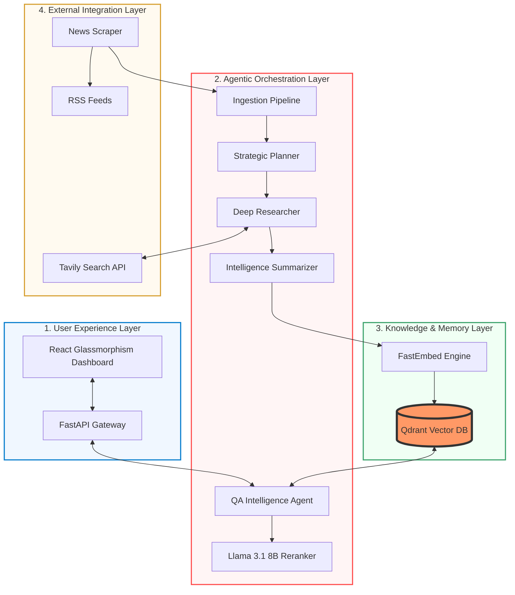

  # Sekilas.ai — Intelligent Multi-Agent News Intelligence
  **Autonomous Multi-Agent Orchestration, Deep Research, and Agentic-RAG with Reasoning.**
  
  
  
  
  
  
  

---

## Overview

**Sekilas.ai** is a state-of-the-art **Multi-Agent System (MAS)** designed to automate the entire news intelligence lifecycle. Unlike traditional aggregators, Sekilas.ai employs specialized AI agents to plan research, investigate external sources, and synthesize complex storylines into actionable intelligence.

This project demonstrates a high-performance **Agentic-RAG** implementation that combines semantic retrieval with cross-model reranking to deliver factual, grounded, and context-aware responses.

## Multi-Agent Architecture

The system is powered by a collaborative agentic workflow:

- **Strategic Planner (Llama 3.1 8B)**: Analyzes trending headlines and identifies topics requiring deep investigation.
- **Deep Researcher (Tavily + Llama 8B)**: Executes autonomous web research to gather historical context and external facts.
- **Intelligence Summarizer (Qwen 2.5 32B)**: Synthesizes raw data and research findings into structured "Story Syntheses" and "Strategic Correlations."
- **Agentic-RAG (Hybrid Search + Reranker)**: An advanced QA agent that utilizes **RRF (Reciprocal Rank Fusion)** and **Llama-based Reranking** to ensure the highest factual precision.

## Key Technical Features

- **Hybrid Intelligence Stack**: Leveraging **Groq Cloud** for ultra-fast inference using **Qwen 2.5 32B** (Summarization) and **Llama 3.1 8B** (Planning & Reranking).
- **Deep Research Integration**: Real-time investigation of niche topics using **Tavily AI** to prevent hallucinations and bridge information gaps.
- **Advanced RAG Pipeline**: High-precision retrieval using **Qdrant** with **Hybrid Search** (Dense + Sparse/BM25) and a dedicated **Cross-Encoder Reranking** stage.
- **Dynamic Reasoning UI**: A transparent "Reasoning Process" logger in the QA interface that shows the agent's internal logic steps in real-time.
- **Temporal Grounding**: Strict awareness of current dates and times to ensure news-at-hand accuracy (WIB Timezone support).

## Technology Stack

### Backend
- **Framework**: FastAPI
- **Orchestration**: Custom State-Based Multi-Agent Logic
- **AI Models**: Qwen 2.5 32B, Llama 3.1 8B, all-MiniLM-L6-v2 (Local Embedding)
- **Search**: Tavily Search API
- **Scraping**: BeautifulSoup4, Feedparser

### Frontend
- **Framework**: React 18+ (TypeScript)
- **Styling**: Vanilla CSS (Premium Glassmorphism Design)
- **Animations**: CSS3 Transitions & Motion-driven logic
- **Icons**: Lucide React

### Infrastructure
- **Vector DB**: Qdrant (Cloud/Local)
- **Deployment**: Docker, GitHub Actions (Daily Cron Pipeline)

## System Flow

---

## Configuration

Required Environment Variables:
- `GROQ_API_KEY`: For Llama & Qwen models.
- `TAVILY_API_KEY`: For the Deep Researcher agent.
- `QDRANT_URL` / `QDRANT_API_KEY`: Vector database credentials.
- `EMBEDDING_MODEL`: Current: `sentence-transformers/all-MiniLM-L6-v2`.

---

## Author

**Felix Hardyan**
*   [GitHub](https://github.com/flxhrdyn)
