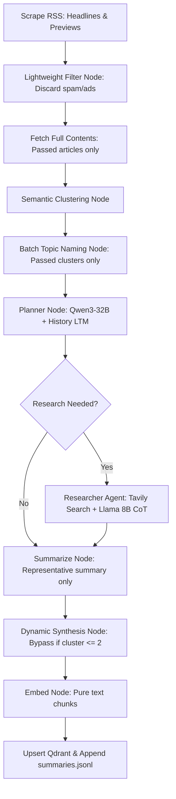

# Overhauled Design Spec: Optimized Agentic RAG, Rebalancing & CoT

**Date:** 2026-06-02  
**Branch:** feature/ui-ux-refinement-v3  
**Status:** Approved (Overhauled)

## Overview

This overhauled specification completely addresses architectural inefficiencies in the pipeline's latency, token costs, and logic flow:
1. **Model Rebalancing**: Promote the Planner agent to Qwen3-32B (strategic reasoning). Demote high-volume agents (Researcher, Summarizer, Classifier, QA) to Llama-3.1-8B-instant and enable Chain-of-Thought (CoT) prompting using English few-shot examples with `<thinking>` wrappers.
2. **Pre-Filter Pipeline Realignment**: Invert the pipeline flow. We now filter out noise/spam using lightweight headline+preview classification *before* downloading heavy full article contents or clustering. This saves substantial network bandwidth, paywall failures, and redundant LLM cluster-naming costs.
3. **Dynamic Synthesis Fallback**: For small news clusters (size <= 2), bypass the secondary LLM synthesis pass and directly utilize the representative summary, eliminating duplicate API calls.
4. **Optimized Embedding Payload**: Stop duplicating summary and key point text in every chunk's vector embedding. Summary and key points are stored strictly in the payload metadata, keeping semantic embeddings pure and FastEmbed processing incredibly fast.
5. **Single-Pass Active QA Router**: Replace the double-pass RAG QA evaluation with a Single-Pass Router. The QA model attempts to answer, returning `[NEED_WEB_SEARCH]` if context is insufficient. The system intercepts this token, triggers a Tavily search on-the-fly, and reprompts.
6. **JSON Lines (JSONL) Persistence**: Replace memory-heavy read-write cycles of `summaries.json` with an efficient, append-only JSONL format (`summaries.jsonl`).

---

## realigned Pipeline Flow



---

## Model Assignment

| Agent | File | Before | After |
|---|---|---|---|
| `NewsPlannerAgent` | `agents/planner.py` | `llama3-8b-8192` | `qwen/qwen3-32b` |
| `NewsResearcherAgent` | `agents/researcher.py` | `llama3-8b-8192` | `llama-3.1-8b-instant` + CoT |
| `NewsSummarizerAgent` | `agents/summarizer.py` | `qwen/qwen3-32b` | `llama-3.1-8b-instant` + CoT |
| NewsFilter (classifier) | `tools/filter.py` | `qwen/qwen3-32b` | `llama-3.1-8b-instant` + CoT |
| QA Chain | `rag/qa_chain.py` | `qwen/qwen3-32b` | `llama-3.1-8b-instant` + CoT |

**Groq model string:** `llama-3.1-8b-instant` (128K context, fastest Llama 8B on Groq)

---

## Detailed Architectural Fixes

### 1. Pre-Filtering Flow
Instead of fetching the full content of all 18 best representatives and running batch classification on the heavy text body, the new flow runs `NewsFilter.run` on the raw headlines + preview descriptions.
* Discarded items are skipped immediately.
* Full-text fetching is only performed for articles that pass.
* Clustering is performed only on clean, passed articles.

### 2. Planner Long-Term Memory (LTM)
The orchestrator reads the last 3 entries from `summaries.jsonl` and feeds the past headlines/topics into the Planner. The Planner prompt is updated in English to analyze:
```
Recent Historical Context:
{historical_context}
```

### 3. Dynamic Synthesis Fallback
If a cluster has only 1 or 2 articles, `synthesize_story` is bypassed. The synthetic output defaults to:
```python
{
    "synthesis": key_points_from_representative,
    "impact_level": "LOW",
    "impact_reason": "Single article cluster."
}
```

### 4. Optimized Embedding Chunk Payload
`text_to_embed = chunk_text` (100% pure). We no longer append summary and key points to the embedding text. The summary and key points are stored in the Qdrant metadata payload.

### 5. Single-Pass Active QA Router
Instead of evaluating context sufficiency first via Llama 8B, the QA chain executes a single prompt. If the local context lacks information, the prompt guides Llama 8B to output a fallback trigger token:
```
[NEED_WEB_SEARCH]
```
If this token is detected in python, the QA chain dynamically executes Tavily Search and performs a second pass with the new web context.

### 6. Append-Only JSONL
`summaries.jsonl` is written in append mode, avoiding full read-write memory overhead.
```python
with open(settings.summaries_file, "a", encoding="utf-8") as f:
    f.write(json.dumps(digest_record, ensure_ascii=False) + "\n")
```

---

## Files to Modify

* `backend/config/settings.py` - Configure model defaults and update `summaries_file` path to `summaries.jsonl`.
* `backend/agents/planner.py` - Convert prompts to English with LTM support.
* `backend/agents/researcher.py` - Convert prompts to English with CoT thinking tag.
* `backend/tools/filter.py` - Update categories to English. Support lightweight classification on headlines+previews.
* `backend/agents/summarizer.py` - English prompts, CoT inclusion, dynamic synthesis bypass.
* `backend/rag/qa_chain.py` - Single-Pass Router prompt with `[NEED_WEB_SEARCH]` trigger and dynamic Tavily fallback.
* `backend/pipeline/orchestrator.py` - Align pipeline graph nodes to: Scrape -> Filter (Headline+Preview) -> Fetch passed -> Cluster -> Name -> Plan -> Research -> Summarize -> Embed -> Upsert. Translate comments and logs to English. Write JSONL append output.
